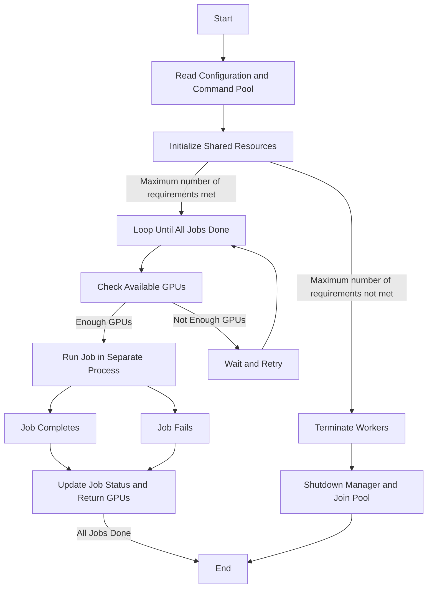

# RunIt

> [!NOTE]
> This tool still has some limitations.
> If you encounter any problems in use, please feel free to ask.

A simple program scheduler for your code on different devices.

Let the machine move!

Putting the machine into sleep is a disrespect for time.

## Usage

> [!note]
>
> 2024-8-14: Now, the config file contains the information of your GPUs and jobs, more details can be found in [config.py](./examples/config.py).

### `runit_with_exclusive_gpu.py`

One GPU can only be used by one job at a time.

```shell
$ python ./runit_with_exclusive_gpu.py --help
usage: runit_with_exclusive_gpu.py [-h] --config CONFIG [--max-workers MAX_WORKERS] [--interval-for-waiting-gpu INTERVAL_FOR_WAITING_GPU] [--interval-for-loop INTERVAL_FOR_LOOP]

optional arguments:
  -h, --help            show this help message and exit
  --config CONFIG       The path of the yaml containing all information of gpus and cmds.
  --max-workers MAX_WORKERS
                        The max number of the workers.
  --interval-for-waiting-gpu INTERVAL_FOR_WAITING_GPU
                        In seconds, the interval for waiting for a GPU to be available.
  --interval-for-loop INTERVAL_FOR_LOOP
                        In seconds, the interval for looping.
```

### `runit_with_exclusive_gpu.py`

One GPU can be used by many job at a time based on the memory usage.

```
$ python ./runit_based_on_memory.py --help
usage: runit_based_on_memory.py [-h] --config CONFIG [--max-workers MAX_WORKERS] [--interval-for-waiting-gpu INTERVAL_FOR_WAITING_GPU] [--interval-for-loop INTERVAL_FOR_LOOP]

optional arguments:
  -h, --help            show this help message and exit
  --config CONFIG       The path of the yaml containing all information of gpus and cmds.
  --max-workers MAX_WORKERS
                        The max number of the workers.
  --interval-for-waiting-gpu INTERVAL_FOR_WAITING_GPU
                        In seconds, the interval for waiting for a GPU to be available.
  --interval-for-loop INTERVAL_FOR_LOOP
                        In seconds, the interval for looping.
```

## demo

```shell
$ python run_it.py --config ./examples/config.yaml
$ python run_it.py --max-workers 3 --config ./examples/config.yaml
```



## Thanks

- [@BitCalSaul](https://github.com/BitCalSaul): Thanks for the positive feedbacks!
  - <https://github.com/lartpang/RunIt/issues/3>
  - <https://github.com/lartpang/RunIt/issues/2>
  - <https://github.com/lartpang/RunIt/issues/1>
- https://www.jb51.net/article/142787.htm
- https://docs.python.org/zh-cn/3/library/subprocess.html
- https://stackoverflow.com/a/23616229
- https://stackoverflow.com/a/14533902
