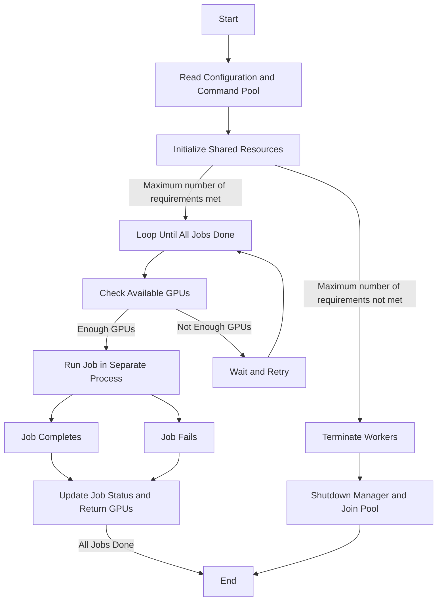

# RunIt

> [!NOTE]
> This tool still has some limitations.
> If you encounter any problems in use, please feel free to ask.

A simple program scheduler for your code on different devices.

Let the machine move!

Putting the machine into sleep is a disrespect for time.

## Usage

```shell
$ python run_it.py --help
usage: run_it.py [-h] [--gpu-pool GPU_POOL [GPU_POOL ...]] [--max-workers MAX_WORKERS] --cmd-pool CMD_POOL
                 [--interval-for-waiting-gpu INTERVAL_FOR_WAITING_GPU] [--interval-for-loop INTERVAL_FOR_LOOP]

optional arguments:
  -h, --help            show this help message and exit
  --gpu-pool GPU_POOL [GPU_POOL ...]
                        The pool containing all ids of your gpu devices.
  --max-workers MAX_WORKERS
                        The max number of the workers.
  --cmd-pool CMD_POOL   The path of the yaml containing all cmds.
  --interval-for-waiting-gpu INTERVAL_FOR_WAITING_GPU
                        In seconds, the interval for waiting for a GPU to be available.
  --interval-for-loop INTERVAL_FOR_LOOP
                        In seconds, the interval for looping.
```

## demo

```shell
$ python run_it.py --cmd-pool ./examples/config.yaml # with the default `gpu-pool` and `max-workers`
$ python run_it.py --gpu-pool 0 2 3 --max-workers 3 --cmd-pool .\examples\config.yaml
```

<details>
<summary>
./examples/config.yaml
</summary>

```yaml
- name: job1
  command: "python ./examples/demo.py --value 1"
  num_gpus: 1
- name: job2
  command: "python ./examples/demo.py --value 2"
  num_gpus: 1
- name: job3
  command: "python ./examples/demo.py --value 3"
  num_gpus: 1
- name: job4
  command: "python ./examples/demo.py --value 4"
  num_gpus: 1
- name: job5
  command: "python ./examples/demo.py --value 5"
  num_gpus: 2
- { name: job6, command: "python ./examples/demo.py --value 5", num_gpus: 2 }
- { name: job7, command: "python ./examples/demo.py --value 5", num_gpus: 2 }
```

 </details>



## Thanks

[@BitCalSaul](https://github.com/BitCalSaul): Thanks for the positive feedbacks!
  - <https://github.com/lartpang/RunIt/issues/3>
  - <https://github.com/lartpang/RunIt/issues/2>
  - <https://github.com/lartpang/RunIt/issues/1>
- https://www.jb51.net/article/142787.htm
- https://docs.python.org/zh-cn/3/library/subprocess.html
- https://stackoverflow.com/a/23616229
- https://stackoverflow.com/a/14533902
