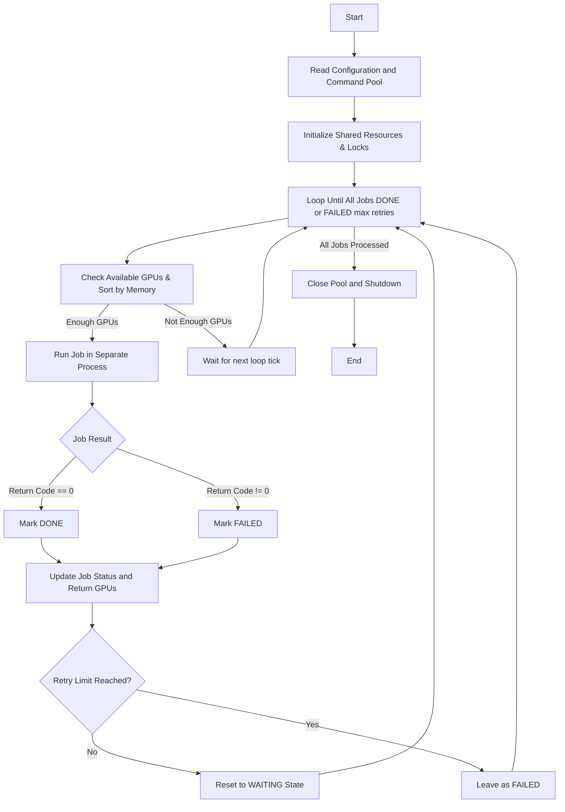

# RunIt

> [!NOTE]
> This tool still has some limitations.
> If you encounter any problems in use, please feel free to ask.

> [!WARNING]
> Due to the current lack of available GPU resources, the latest multi-process locking, return code capturing, and Ray-based scripts have **NOT** been fully tested on physical multi-GPU environments.
> Please use these updated scripts with caution in production, and report any undiscovered bugs.

A simple and highly concurrent program scheduler for your code on different GPUs.

Let the machine move!

Putting the machine into sleep is a disrespect for time.

## Usage

> [!note]
>
> 2024-8-14: Now, the config file contains the information of your GPUs and jobs, more details can be found in [config.py](./examples/config.py).

### Dependency

- PyYAML==6.0
- nvidia-ml-py (`pynvml` only for `runit_based_on_detected_memory.py`)
- ray (Only for `runit_based_on_ray.py`)

### Scripts

We provides 4 scripts for different ways to run jobs.

- `runit_with_exclusive_gpu.py`: One GPU can only be used by one job at a time.
- `runit_based_on_memory.py`: One GPU can be used by many jobs at a time based on the memory usage.
- `runit_based_on_detected_memory.py`: Use `pynvml` for detecting the total memory usage of each GPU. *But this may not be suitable for scenarios where the memory used by a running GPU application is unstable.*
- `runit_based_on_ray.py`: 🚀 **(New)** A modern, highly flexible alternative powered by [Ray](https://docs.ray.io/). It natively implements **VRAM Bin Packing** by converting memory requests into "Fractional GPUs" (e.g., `4000MB / 24000MB = 0.166` GPUs). Relying entirely on Ray's backend, it requires no manual `Lock` processes and safely isolates `CUDA_VISIBLE_DEVICES` natively and perfectly.

## demo

```shell
$ python runit_based_on_memory.py --config ./examples/config.yaml
$ python runit_based_on_ray.py --config ./examples/config.yaml --max-retries 1
```


```mermaid
graph TD
    A[Start] --> B[Read Configuration and Command Pool]
    B --> C[Initialize Shared Resources & Locks]
    C --> D[Loop Until All Jobs DONE or FAILED max retries]
    D --> E[Check Available GPUs & Sort by Memory]
    E -->|Enough GPUs| F[Run Job in Separate Process]
    E -->|Not Enough GPUs| G[Wait for next loop tick]
    F --> H{Job Result}
    H -->|Return Code == 0| I[Mark DONE]
    H -->|Return Code != 0| J[Mark FAILED]
    I --> K[Update Job Status and Return GPUs]
    J --> K
    K --> L{Retry Limit Reached?}
    L -->|No| M[Reset to WAITING State]
    L -->|Yes| N[Leave as FAILED]
    M --> D
    N --> D
    G --> D
    D -->|All Jobs Processed| O[Close Pool and Shutdown]
    O --> P[End]
```

## Thanks

- [@BitCalSaul](https://github.com/BitCalSaul): Thanks for the positive feedbacks!
  - <https://github.com/lartpang/RunIt/issues/3>
  - <https://github.com/lartpang/RunIt/issues/2>
  - <https://github.com/lartpang/RunIt/issues/1>
- https://www.jb51.net/article/142787.htm
- https://docs.python.org/zh-cn/3/library/subprocess.html
- https://stackoverflow.com/a/23616229
- https://stackoverflow.com/a/14533902
